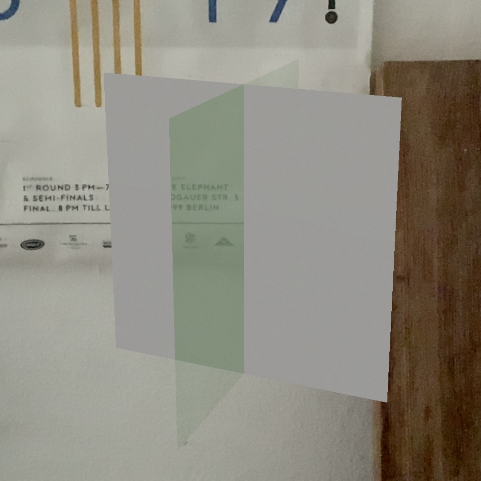

# SceneKitTransparencyBug
Basic app to investigate a SceneKit transparency bug

There is a problem with the transparency in SceneKit. When a plane is transparent, I should obviously see the plane behind through the transparency but no further.
It seems SceneKit makes everything transparent. Please see the image. If you have a workaround pls answer here or in this SO post:   [SceneKit transparent node, transparent material](https://stackoverflow.com/q/44761374/9497800) 

This should not happen, I should not see through a non transparent layer only because a transparent one is in front! :)

